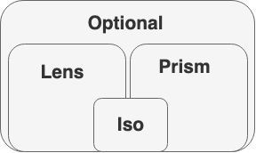

class:  default
.left-column[
 # Optics
 #### [Lens](#2)
 #### [Iso](#17)
 #### [Prism](#28)
 #### [Optional](#44)
]
- presentation available at [martintupy.github.io/showcase](https://martintupy.github.io/showcase/)
- sources available at [github.com/martintupy/showcase](https://github.com/martintupy/showcase)
- exercises at [github.com/martintupy/tryhard](https://github.com/martintupy/tryhard)
- monocle at [julien-truffaut.github.io/Monocle/](https://julien-truffaut.github.io/Monocle/)

1. download and install `sbt` [scala-sbt.org](https://www.scala-sbt.org/)
  - `brew install sbt`
2. clone [github.com/martintupy/tryhard](https://github.com/martintupy/tryhard)
  - `git clone https://github.com/martintupy/tryhard`
3. open in IntellIJ (or other IDE)
  - File > Open > tryhard/build.sbt > Open as project > OK
<!-------------------------------------------------------------------------->
---
class: center, middle, default
# Lens 🔎

<!-------------------------------------------------------------------------->
---

class: default

.left-column[
# Lens
### - core
]

A Lens is an optic (purely functional abstraction over `get` and `set`)
mostly for Product types, e.g. `case class`, `Tuple` , `HList` ...

`Lens[S, A]` where: 
 - `S` represents the Product
 - `A` an element inside of `S`

```scala
trait Lens[S, A] {
  def get(s: S): A

  def set(a: A)(s: S): S
}
```
- get: `S => A`
- set: `A => S => S`
<!-------------------------------------------------------------------------->
---
class: default

.left-column[
# Lens
### - core
]
A Lens is an optic (purely functional abstraction over `get` and `set`)
mostly for Product types, e.g. `case class`, `Tuple` , `HList` ...

`Lens[S, A]` where: 
 - `S` represents the Product
 - `A` an element inside of `S`

```scala
trait Lens[S, A] {
  def get(s: S): A

  def set(a: A)(s: S): S

  def modify(f: A => A)(s: S): S = set(f(get(s)))(s)
}
```
- get: `S => A`
- set: `A => S => S`
- modify: `(A => A) => S => S`
<!-------------------------------------------------------------------------->
---
class: default
.left-column[
# Lens
### - core
### - example
]

```scala
case class Street(number: Int, name: String)

val streetName = new Lens[Street, String] {  
  def get(s: Street): String = s.name  
  
  def set(a: String)(s: Street): Street = s.copy(name = a)  
}

val street = Street(23, "High")
// Street(23, High)

streetName.modify(_ + " Street")(street)
// Street(23, Hight Street)
```
<!-------------------------------------------------------------------------->
---
class: default
.left-column[
#Lens
### - core
### - example
]

```scala
case class Street(number: Int, name: String)
case class Address(city: String, street: Street)  
  
val streetName = new Lens[Street, String] {  
  def get(s: Street): String = s.name  
  def set(a: String)(s: Street): Street = s.copy(name = a)  
}  
  
val addressStreet = new Lens[Address, Street] {  
  def get(s: Address): Street = s.street
  def set(a: Street)(s: Address): Address = s.copy(street = a)  
}

val street = Street(23, "High")
val address = Address("London", street)

// (address ??? street).modify(_ + " Street") 
```
<!-------------------------------------------------------------------------->
---
class: default
.left-column[
#Lens
### - core
### - example
### - composition
]

```scala
trait Lens[S, A] { self =>  
  def get(s: S): A  
  
  def set(a: A)(s: S): S  
  
  def modify(f: A => A)(s: S): S = set(f(get(s)))(s)  
  
  def compose[B](other: Lens[A, B]): Lens[S, B] = new Lens[S, B] {
  
    def get(s: S): B = other.get(self.get(s))  
  
    def set(b: B)(s: S): S = self.set(other.set(b)(self.get(s)))(s)  
  }  
}
```
- types in compose need to match `S => A`, `A => B`  ->  `S => B`
<!-------------------------------------------------------------------------->
---
class: default
.left-column[
#Lens
### - core
### - example
### - composition
]

```scala
case class Street(number: Int, name: String)
case class Address(city: String, street: Street)
val streetName = new Lens[Street, String] {  
  def get(s: Street): String = s.name  
  def set(a: String)(s: Street): Street = s.copy(name = a)  
}  
val addressStreet = new Lens[Address, Street] {  
  def get(s: Address): Street = s.street
  def set(a: Street)(s: Address): Address = s.copy(street = a)  
}
val street = Street(23, "High")
val address = Address("London", street)   
val usingLens = addressStreet.compose(streetName).modify(_ + " Street")
val usingCopy = address.copy(street = address.street
  .copy(name = address.street.name + "Street")
)
usingLens(address)
// Address(London, Street(23, Hight Street))
```
<!-------------------------------------------------------------------------->
---
class: default
.left-column[
#Lens
### - core
### - example
### - composition
### - Monocle
]
- macro generated Lens - `GenLens` 
- using scala macros to access fields

```scala
import monocle.macros.GenLens

case class Street(number: Int, name: String)
case class Address(city: String, street: Street)

GenLens[Street](_.name)
```
- GenLens has _built in_ compose

```scala
val street = Street(23, "High")
val address = Address("London", street) 

GenLens[Address](_.street.name).modify(_ + " Street")(address)
// Address(London, Street(23, Hight Street))

GenLens[Address](_.street.name).set("Long Street")(address)
// Address(London, Street(23, Long Street))
```
<!-------------------------------------------------------------------------->
---
class: default
.left-column[
#Lens
### - core
### - example
### - composition
### - Monocle
]
- `GenLens` syntax - lens method on `case class`

```scala
import monocle.macros.syntax.lens._
case class Street(number: Int, name: String)  
case class Address(city: String, street: Street)  
case class Company(name: String, address: Address)  
case class Employee(name: String, company: Company)
val employee = Employee("john", Company("awesome inc", 
  Address("london", Street(23, "high street"))
))
// Using Lens composition 
employee.lens(_.company.address.street.number).modify(_ + 100)  
// Using scala copy  
employee.copy(  
  company = employee.company.copy(  
    address = employee.company.address.copy(  
      street = employee.company.address.street.copy(  
        number = employee.company.address.street.number + 100  
))))
```
<!-------------------------------------------------------------------------->
---
class: default
.left-column[
#Lens
### - core
### - example
### - composition
### - Monocle
]
- can be also chained and used on multiple levels
```scala
employee  
  .lens(_.name).set("Mike")  
  .lens(_.company.address.city).modify(_.toUpperCase)  
  .lens(_.company.address.street.name).set("long street")
// Employee(Mike, Company(awesome inc, Address(LONDON, Street(23, long street))))
```
<!-------------------------------------------------------------------------->
---
class: default
.left-column[
#Lens
### - core
### - example
### - composition
### - Monocle
### - laws
]

```scala
def getSet[S, A](l: Lens[S, A], s: S): Boolean = l.set(l.get(s))(s) == s

def setGet[S, A](l: Lens[S, A], s: S, a: A): Boolean = l.get(l.set(a)(s)) == a
```
<!-------------------------------------------------------------------------->
---
class: center, middle, default
# Monocle
<!-------------------------------------------------------------------------->
---
class: default
.left-column[
# Monocle
]
- [julien-truffaut.github.io/Monocle/optics/lens.html](http://julien-truffaut.github.io/Monocle/optics/lens.html)

- sbt

`libraryDependencies += "com.github.julien-truffaut" %% "monocle" % "2.0.0"`

- gradle

`group: "com.github.julien-truffaut" name: "monocle" version: "2.0.0"`

- compatible with cats 2.0
<!-------------------------------------------------------------------------->
---

class: center, middle, default

# Optics

<!-------------------------------------------------------------------------->
---
class: default
.left-column[
  # Optics

]
Optics are a group of purely functional abstractions to manipulate `get`, `set` of immutable objects.
- `Iso` - Isomorphic types
- `Prism` - Coproduct (Sum) types 
- `Lens` - Product Types
- `Optional` - Generalized for (Lens + Prism)


<!-------------------------------------------------------------------------->
---

class: center, middle, default
# Iso 🤝
<!-------------------------------------------------------------------------->
---
class: default
.left-column[
# Iso
### - core
]

- isomorphic types (in sense what data they represent)
- `Iso[S, A]`
- `S` contains same data as `A`

```scala
trait Iso[S, A] {
  def get(s: S): A   
  def reverseGet(a: A): S
}
```

  - get: `A => B`
  - reverseGet: `B => A`
<!-------------------------------------------------------------------------->
---
class: default
.left-column[
# Iso
### - core
]
- isomorphic types (in sense what data they represent)
- `Iso[S, A]`
- `S` contains same data as `A`

```scala
trait Iso[S, A] {
  def get(a: S): A
  def reverseGet(a: A): S
  def reverse: Iso[A, S] = new Iso[A, S] {
    def get(a: A): S = self.reverseGet(a)
    def reverseGet(s: S): A = self.get(s)
  }
}
```
  - get: `A => S`
  - reverseGet: `S => A`
  - reverse: swapped `A` for `S`
<!-------------------------------------------------------------------------->
---
class: default
.left-column[
# Iso
### - core
### - examples
]
- `List` <=> `Vector`

- `Map[K, V]` <=> `List[(K, V)]`

- `String` <=> `List[Char]`

- `case class` <=> `Tuple` <=> `HList` *(size <= 22)

- wrapped one field in case class <=> field

  `case class JsonNum(n: Double)` <=> `Double`
  
- Celsius <=> Fahrenheit

- meter <=> centimeter

- Gigabyte <=> KiloByte
- ...
<!-------------------------------------------------------------------------->
---
class: default
.left-column[
# Iso
### - core
### - examples
]

```scala
//Server app
case class ServerStreet(number: Int, name: String)  
case class ServerAddress(city: String, street: ServerStreet)  
case class ServerCompany(name: String, address: ServerAddress)  
case class ServerEmployee(name: String, company: ServerCompany)  

//Client app
case class ClientStreet(number: Int, name: String)  
case class ClientAddress(city: String, street: ClientStreet)  
case class ClientCompany(name: String, address: ClientAddress)  
case class ClientEmployee(name: String, company: ClientCompany)  
```
<!-------------------------------------------------------------------------->
---
class: default
.left-column[
# Iso
### - core
### - examples
### - Monocle
]
- `Iso.apply`
```scala
def apply[S, A](get: S => A)(reverseGet: A => S): Iso[S, A]
```
<!-------------------------------------------------------------------------->
---
class: default
.left-column[
# Iso
### - core
### - examples
### - Monocle
]
- `GenIso`
- macro generated iso
- only one field case class
 
```scala
case class JNum(n: Double)
  
val jNumDoubleIso = GenIso[JNum, Double]

case class Person(name: String, age: Int)
// val personNameIso = GenIso[Person, String] won't work
```
<!-------------------------------------------------------------------------->
---
class: default
.left-column[
# Iso
### - core
### - examples
### - Monocle
]

```scala
val serverEmployee = ServerEmployee("john", ServerCompany("awesome inc", 
  ServerAddress("london", ServerStreet(23, "high street"))
))  
val serverToClientIso = Iso[ServerEmployee, ClientEmployee] { employee =>  
  ClientEmployee(employee.name,  
    ClientCompany(employee.company.name,  
      ClientAddress(employee.company.address.city,  
        ClientStreet(employee.company.address.street.number, 
          employee.company.address.street.name
  ))))
} { employee =>  
  ServerEmployee(employee.name,  
    ServerCompany(employee.company.name,  
      ServerAddress(employee.company.address.city,  
        ServerStreet(employee.company.address.street.number,
          employee.company.address.street.name
))))}  
val client: ClientEmployee = serverToClientIso.get(serverEmployee)  
```
<!-------------------------------------------------------------------------->
---
class: default
.left-column[
# Iso
### - core
### - examples
### - Monocle
### - laws
]

```scala
def roundTripOneWay[S, A] (i: Iso[S, A], s: S): Boolean = 
  i.reverseGet(i.get(s)) == s  

def roundTripOtherWay[S, A] (i: Iso[S, A], a: A): Boolean = 
  i.get(i.reverseGet(a)) == a
```
<!-------------------------------------------------------------------------->
---
class: default, center, middle
# Tryhard time 😭
<!-------------------------------------------------------------------------->
---
class: default
.left-column[
  # Tryhard time
]
  - optics.Iso
    - `def composeIso[B] (other: Iso[A, B]): Iso[S, B]` (1) 
    - `def asLens: Lens[S, A] = new Lens[S, A]` (1)
    - `def composeLens[B] (lens: Lens[A, B]): Lens[S, B]` (2)

- optics.Lens
  - `def composeIso[B] (iso: Iso[A, B]): Lens[S, B]` (2)

- optics.WareHouse
  - `val normalizedStorage: WareHouse` (3)
- Lens, Iso - build
- WareHouse - run main

1. implement 1./2.
2. implement 3./4., Use already implemented methods
3. `import monocle.macros.syntax.lens._`, chained lens syntax
<!-------------------------------------------------------------------------->
---
class: default, center, middle
# Prism 🧐
<!-------------------------------------------------------------------------->
---
class: default
.left-column[
  # Prism
  ### - motivation
]
```scala
def modifyStringError(e: Either[String, Int]): Either[String, Int] = {
  e match {
    case Left(s) => Left(s"Error occurred: $s")
    case Right(_) => e
  }
}
modifyStringError(Left("Wrong side"))
// Left(Error occurred: Wrong side)
modifyStringError(Right(23))
// Right(23)
```
<!-------------------------------------------------------------------------->
---
class: default
.left-column[
  # Prism
  ### - motivation
]

```scala
def modifyStringError(e: Either[String, Int], errStack: List[String]):
Either[String, Int] = {
  e match {
    case Left(s) => Left(s"Errors occurred: $s ${errStack.mkString(" ")}")
    case Right(_) => e
  }
}
modifyStringError(Left("Wrong side"), List("Error1", "Error2"))
// Left(Errors occurred: Wrong side Error1 Error2)
modifyStringError(Right(23), List.empty)
// Right(23)
```

???
- abstraction over one item in pattern match ?
- see the repetition, can be abstracted ?

<!-------------------------------------------------------------------------->
---
class: default
.left-column[
  # Prism
  ### - motivation
  ### - core
]
- usually for Coproduct (Sum) types
- `Prism[S, A]`
- `S` can be a `A` - getOption
- `A` is a `S` - reverseGet
- `Either`, `sealed trait`, `Enum`

```scala
trait Prism[S, A] {
  def getOption(s: S): Option[A]
  def reverseGet(a: A): S
}
```

<!-------------------------------------------------------------------------->
---
class: default
.left-column[
  # Prism
  ### - motivation
  ### - core
]
- usually for Coproduct (Sum) types
- `Prism[S, A]`
- `S` can be a `A` - getOption
- `A` is a `S` - reverseGet
- `Either`, `sealed trait`, `Enum`

```scala
trait Prism[S, A] {
  def getOption(s: S): Option[A]
  def reverseGet(a: A): S
  def modify(f: A => A)(s: S): S = 
    getOption(s).map(a => reverseGet(f(a))).getOrElse(s)
}
```
<!-------------------------------------------------------------------------->
---
class: default
.left-column[
  # Prism
  ### - motivation
  ### - core
  ### - examples
]
- `A | B | C` to `B`

 `B` is a `A | B | C`, `A | B | C` can be `B`  
- `Either` to `Right`

 `Right` is a `Either`, `Either` can be `Right`
- `Either` to `Left`

- `Either[Int, String]` to `String`

- `Json` to `Number`

- `Double` to `Int`

- `Long` to `Int`

???
- Sum types
- Not only Sum types 
- maybe get Int out of Double or Long
- Int is Double or Long
<!-------------------------------------------------------------------------->
---
class: default
.left-column[
  # Prism
  ### - motivation
  ### - core
  ### - examples
]

#### Either
    
```scala
val stringPrism = new Prism[Either[String, Int], String] {
  def getOption(s: Either[String, Int]): Option[String] = 
    s.fold(e => Some(e), _ => None)

  def reverseGet(a: String): Either[String, Int] = Left(a)
}
```
    
- `String` is a `Either[Int, String]`
- `Either[Int, String]` can be a `String`
???
- this Prism is 2 levels deep - skipped Right
<!-------------------------------------------------------------------------->
---
class: default
.left-column[
  # Prism
  ### - motivation
  ### - core
  ### - examples
]

#### Either
    
```scala
val stringPrism = new Prism[Either[String, Int], String] {
  def getOption(s: Either[String, Int]): Option[String] = 
    s.fold(e => Some(e), _ => None)

  def reverseGet(a: String): Either[String, Int] = Left(a)
}
```
```scala
def modifyStringError(e: Either[String, Int]): Either[String, Int] =
  stringPrism.modify(err => s"Error occurred: $err")(e)

def modifyStringError(e: Either[String, Int], errStack: List[String]): 
Either[String, Int] =
  stringPrism.modify(err => s"Errors occurred: $err ${errStack.mkString(" ")}")(e)
```
???
- notice trailing argument e that was abstracted
<!-------------------------------------------------------------------------->
---
class: default
.left-column[
  # Prism
  ### - motivation
  ### - core
  ### - examples 
]
#### sealed trait
    
```scala
sealed trait Json
case object JNull extends Json
case class JStr(v: String) extends Json
case class JNum(v: Double) extends Json
case class JBool(v: Boolean) extends Json
```
```scala
val jsonDoublePrism = new Prism[Json, Double] {
  def getOption(s: Json): Option[Double] = s match {
    case JNum(num) => Some(num)
    case _ => None
  }
  def reverseGet(a: Double): Json = JNum(a)
}
``` 
???
- again, 2 levels deep prism, Double out of Json
- double is Json, Json can contain double
<!-------------------------------------------------------------------------->
---
class: default
.left-column[
  # Prism
  ### - motivation
  ### - core
  ### - examples 
]
#### sealed trait

```scala
val jsonDoublePrism = new Prism[Json, Double] {
  def getOption(s: Json): Option[Double] = s match {
    case JNum(num) => Some(num)
    case _ => None
  }
  def reverseGet(a: Double): Json = JNum(a)
}
``` 
```scala
val doubleIntPrism = new Prism[Double, Int] {
  def getOption(d: Double): Option[Int] = if(d.isValidInt) Some(d.toInt) else None
  def reverseGet(a: Int): Double = a.toDouble
}
```
```scala
val jsonIntPrism: Prism[Json, Int] = ???
```
???
- Json -> Double -> Int
- composition ?
<!-------------------------------------------------------------------------->
---
class: default
.left-column[
  # Prism
  ### - motivation
  ### - core
  ### - examples
  ### - composition
]

```scala
trait Prism[S, A] {
  def getOption(s: S): Option[A]
  def reverseGet(a: A): S
  def modify(f: A => A)(s: S): S = 
    getOption(s).map(a => reverseGet(f(a))).getOrElse(s)

  def composePrism[B](other: Prism[A, B]): Prism[S, B] = new Prism[S, B] {
    def getOption(s: S): Option[B] = 
      self.getOption(s).flatMap(a => other.getOption(a))

    def reverseGet(b: B): S = self.reverseGet(other.reverseGet(b))
  }
}
```
???
- every Int is Double, every Double is Json, therefore every Int is Json
<!-------------------------------------------------------------------------->
---
class: default
.left-column[
  # Prism
  ### - motivation
  ### - core
  ### - examples
  ### - composition
]

```scala
val jsonDoublePrism = new Prism[Json, Double] {
  def getOption(s: Json): Option[Double] = s match {
    case JNum(num) => Some(num)
    case _ => None
  }
  def reverseGet(a: Double): Json = JNum(a)
}

val doubleIntPrism = new Prism[Double, Int] {
  def getOption(s: Double): Option[Int] = if (s.isValidInt) Some(s.toInt) else None
  def reverseGet(a: Int): Double = a.toDouble
}

val jsonIntPrism: Prism[Json, Int] = jsonDoublePrism composePrism doubleIntPrism

jsonIntPrism.modify(_ + 5)(JNum(10.1))
// JNum(10.1)
jsonIntPrism.modify(_ + 5)(JNum(10))
// JNum(15.0)
```
???
- Double.isValidInt - used iso law to check if it's a valid int 
<!-------------------------------------------------------------------------->
---
class: default
.left-column[
  # Prism
  ### - motivation
  ### - core
  ### - examples
  ### - composition
  ### - Monocle
]
- using Prism.apply

```scala
object Prism {
  def apply[S, A](getOption: S => Option[A])(reverseGet: A => S): Prism[S, A]
} 
```
```scala
import monocle.Prism

val jStr = Prism[Json, String] {
  case JStr(v) => Some(v)
  case _       => None
} (JStr)

val string = JStr("string")
jStr.modifyOption(_.reverse)(string)
// Some(JStr(gnirts))

jStr.modifyOption(_.reverse)(JNum(10))
// None
```
???
- too verbose using just apply method, partial is nicer
- Monocle prism apply method
<!-------------------------------------------------------------------------->
---
class: default
.left-column[
  # Prism
  ### - motivation
  ### - core
  ### - examples
  ### - composition
  ### - Monocle
]
- using Prism.partial
  
```scala
object Prism {
  def partial[S, A](get: PartialFunction[S, A])(reverseGet: A => S): Prism[S, A]
}
```
  
```scala
import monocle.Prism

val jNum = Prism.partial[Json, Double] { case JNum(num) => num } { num => JNum(num) }

val num = JNum(10)
jNum.modifyOption(n => -n)(num)
// Some(JNum(-10.0))
```
???
- reverseGet - JNum.apply
- other than JNum == None

<!-------------------------------------------------------------------------->
---
class: default
.left-column[
  # Prism
  ### - motivation
  ### - core
  ### - examples
  ### - composition
  ### - Monocle
]
- monocle can generate prism for subclasses (1 level deep)

```scala
import monocle.macros.GenPrism
val jNumGen = GenPrism[Json, JNum]
jNumGen.getOption(JNum(20))
// Some(20)
```
```scala
// GenPrism[Json, Double] won't work
```

```scala
sealed trait Sum
object Sum {
  case class Inter(json: Json) extends Sum
}
val sumInter = GenPrism[Sum, Sum.Inter]
//  val sumJNum = GenPrism[Sum, JNum] won't work

```
???
- Json -> JNum
- Json -> Double - won't work
- Sum -> Inter - OK
- Sum -> JNum - won't work

<!-------------------------------------------------------------------------->
---
class: default
.left-column[
  # Prism
  ### - motivation
  ### - core
  ### - examples
  ### - composition
  ### - Monocle
  ### - laws
]

```scala
def partialRoundTripOneWay[S, A](p: Prism[S, A], s: S): Boolean =
  p.getOption(s) match {
    case None    => true // nothing to prove
    case Some(a) => p.reverseGet(a) == s
  }
  
def partialRoundTripOneWay[S, A](p: Prism[S, A], a: A): Boolean =
  p.getOption(p.reverseGet(a)) == Some(a)
```

???
- if I get something it has to belongs to source
- a is always a source
- a as a source has to getOption Some(itself)

<!-------------------------------------------------------------------------->
---
class: middle center default
# ❓ Optional
<!-------------------------------------------------------------------------->
---
class: default
.left-column[
  # Optional
  ### - motivation
]
```scala
def modifyStringError(e: Error): Error = {
  e match {
    case SyntaxError(message) => 
      SyntaxError(s"Error occurred: ${message}")
    case InvalidArgument(message, n) => 
      InvalidArgument(s"Error occurred: ${message}", n)
    case _ => e
  }
}

modifyStringError(SyntaxError("Do not conform"))
// SyntaxError(Error occurred: Do not conform)

modifyStringError(ArithmeticError(1, 0))
// ArithmeticError(1, 0)
```
<!-------------------------------------------------------------------------->
---
class: default
.left-column[
  # Optional
  ### - motivation
]
```scala
def mkMessage(errs: List[String]) = s"Errors occurred: ${errs.mkString(", ")}"

def modifyStringError(e: Error, errStack: List[String]): Error = {
  e match {
    case SyntaxError(message) =>
      SyntaxError(mkMessage(errStack :+ message))
    case InvalidArgument(message, n) =>
      InvalidArgument(mkMessage(errStack :+ message), n)
    case _ => e
  }
}

modifyStringError(SyntaxError("Do not conform"), List("Error1", "Error2"))
// SyntaxError(Errors occurred: Error1, Error2, Do not conform)
```
<!-------------------------------------------------------------------------->
---
class: default
.left-column[
  # Optional
  ### - motivation
  ### - core
]

- abstract over `Iso`, `Lens`, `Prism`
- has Prism's getOption
- has Lens' set
- `Optional[S, A]`
- `S` can contain an `A` - getOption
- `A` can be set inside of `S` - set

```scala
trait Optional[S, A] {
  def getOption(s: S): Option[A]
  def set(a: A)(s: S): S
}
```
???
- we always want to use least possible abstract optic

<!-------------------------------------------------------------------------->
---
class: default
.left-column[
  # Optional
  ### - motivation
  ### - core
] 

- abstract over `Iso`, `Lens`, `Prism`
- has Prism's getOption
- has Lens' set
- `Optional[S, A]`
- `S` can contain an `A` - getOption
- `A` can be set inside of `S` - set

```scala
trait Optional[S, A] {
  def getOption(s: S): Option[A]
  def set(a: A)(s: S): S
  def modify(f: A => A)(s: S): S = 
    getOption(s).map(a => set(f(a))(s)).getOrElse(s)
}
```
<!-------------------------------------------------------------------------->
---
class: default
.left-column[
  # Optional
  ### - motivation
  ### - core
  ### - examples
]
- certain item in collection

- firstItem (`"headOption"`), lastItem (`"lastOption"`)
- value of key `K` inside `Map[K, V]`
 
 `Optional[S, A]` - trait S, attribute A 
 
- trait that some of it's inheritants has attribute, e.g. `Error` - S, `message` - A
- in other words attribute that doesn't directly identify it's abstraction (unlike `Prism`)

<!-------------------------------------------------------------------------->
---
class: default
.left-column[
  # Optional
  ### - motivation
  ### - core
  ### - examples
]
```scala
sealed trait Error
case class ArithmeticError(arg1: Int, arg2: Int) extends Error
case class SyntaxError(message: String) extends Error
case class InvalidArgument(message: String, n: Int) extends Error

val messageOptional = new Optional[Error, String] {
  def getOption(err: Error): Option[String] = err match {
    case InvalidArgument(message, _) => Some(message)
    case SyntaxError(message) => Some(message)
    case _ => None
  }

  def set(a: String)(err: Error): Error = err match {
    case SyntaxError(_) => SyntaxError(a)
    case InvalidArgument(_, n) => InvalidArgument(a, n)
    case e => e
  }
}
```

<!-------------------------------------------------------------------------->
---
class: default
.left-column[
  # Optional
  ### - motivation
  ### - core
  ### - examples
]
```scala
val errorString = new Optional[Error, String] {
  def getOption(err: Error): Option[String] = err match {
    case InvalidArgument(message, _) => Some(message)
    case SyntaxError(message) => Some(message)
    case _ => None
  }
  def set(a: String)(err: Error): Error = err match {
    case SyntaxError(_) => SyntaxError(a)
    case InvalidArgument(_, n) => InvalidArgument(a, n)
    case e => e
  }
}
```
```scala
def modifyErrorString(e: Error): Error = 
  errorString.modify(message => s"Error occurred: ${message}")(e)
def mkMessage(errs: List[String]) = s"Errors occurred: ${errs.mkString(", ")}"
def modifyErrorString(e: Error, errStack: List[String]): Error = 
  errorString.modify(s => mkMessage(errStack :+ s))(e)
```

<!-------------------------------------------------------------------------->
---
class: default
.left-column[
  # Optional
  ### - motivation
  ### - core
  ### - examples
  ### - composition
]

```scala
sealed trait Error
case class ArithmeticError(arg1: Int, arg2: Int) extends Error
case class SyntaxError(message: String) extends Error
case class InvalidArgument(message: String, n: Int) extends Error

def modifyErrorString(e: Either[Error, Int]): Either[Error, Int] = {
  e match {
    case Left(SyntaxError(message)) => 
      Left(SyntaxError(s"Error occurred: ${message}"))
    case Left(InvalidArgument(message, n)) => 
      Left(InvalidArgument(s"Error occurred: ${message}", n))
    case _ => e
  }
}
modifyErrorString(Left(SyntaxError("Do not conform")))
// Left(SyntaxError(Error occurred: Do not conform))
```
???
- similar to prism
- some of the Errors has message, therefore String doesn't define Error
<!-------------------------------------------------------------------------->
---
class: default
.left-column[
  # Optional
  ### - motivation
  ### - core
  ### - examples
  ### - composition
]
```scala
sealed trait Error
case class ArithmeticError(arg1: Int, arg2: Int) extends Error
case class SyntaxError(message: String) extends Error
case class InvalidArgument(message: String, n: Int) extends Error

def mkMessage(errs: List[String]) = s"Errors occurred: ${errs.mkString(", ")}"
    
def modifyErrorString(e: Either[Error, Int], errStack: List[String]): 
Either[Error, Int] = {
  e match {
    case Left(SyntaxError(message)) =>
      Left(SyntaxError(mkMessage(errStack :+ message)))
    case Left(InvalidArgument(message, n)) =>
      Left(InvalidArgument(mkMessage(errStack :+ message), n))
    case _ => e
  }
}
modifyErrorString(Left(SyntaxError("Do not conform")), List("Error1", "Error2"))
// Left(SyntaxError(Errors occurred: Error1, Error2, Do not conform))
```
<!-------------------------------------------------------------------------->
---
class: default
.left-column[
  # Optional
  ### - motivation
  ### - core
  ### - examples
  ### - composition
]
```scala
trait Prism[S, A] {
  ...
  def asOptional: Optional[S, A]
}

trait Lens[S, A] {
  ...
  def asOptional: Optional[S, A]
}

trait Iso[S, A] {
  ...
  def asOptional: Optional[S, A]
}
```

<!-------------------------------------------------------------------------->
---
class: default
.left-column[
  # Optional
  ### - motivation
  ### - core
  ### - examples
  ### - composition
]
```scala
trait Optional[S, A] { self =>
  def composeOptional[B](other: Optional[A, B]): Optional[S, B] = 
    new Optional[S, B] {
      def getOption(s: S): Option[B] = self.getOption(s)
        .flatMap(a => other.getOption(a))

      def set(b: B)(s: S): S = {
        val setOption = for {
          a <- self.getOption(s)
          b <- other.getOption(a)
        } yield self.set(other.set(b)(a))(s)
        setOption.getOrElse(s)
      }
    }
}
```
<!-------------------------------------------------------------------------->
---
class: default
.left-column[
  # Optional
  ### - motivation
  ### - core
  ### - examples
  ### - composition
]
```scala
def modifyErrorString(e: Either[Error, Int]): Either[Error, Int] = {
  (eitherError composeOptional errorString)
    .modify(message => s"Error occurred: ${message}")(e)
}

def mkMessage(errs: List[String]) = s"Errors occurred: ${errs.mkString(", ")}"

def modifyErrorString2(e: Either[Error, Int], errStack: List[String]):
 Either[Error, Int] = {
  (eitherError composeOptional errorString)
    .modify(s => mkMessage(errStack :+ s))(e)
}
```

<!-------------------------------------------------------------------------->
---
class: default
.left-column[
  # Optional
  ### - motivation
  ### - core
  ### - examples
  ### - composition
  ### - Monocle
]
- `Optional.apply`
```scala
def apply[S, A](getOption: S => Option[A])(set: A => S => S): Optional[S, A]
```

```scala
def first[A] = Optional[Seq[A], A](_.headOption)(a => {
  case _ :: tail => a :: tail
  case list => list
})
def second[A] = Optional[Seq[A], A](_.drop(1).headOption)(a => {
  case first :: _ :: tail => first :: a :: tail
  case list => list
})
def last[A] = Optional[Seq[A], A](_.lastOption)(a => {
  case Nil => Nil
  case list => list.dropRight(1) :+ a
})
last[Int].modify(_ * 10)(List(1, 2, 3))
// List(1, 2, 30)
```
???
- you can play with it in abstraction
- first, second, last - need type, compiler cannot infer
<!-------------------------------------------------------------------------->
---
class: default
.left-column[
  # Optional
  ### - motivation
  ### - core
  ### - examples
  ### - composition
  ### - Monocle
]

```scala
def nthOptional[A](n: Int) = 
  Optional[Iterable[A], A](_.drop(n).headOption) { a => list =>
    val (l, r) = list.splitAt(n)
    l ++ Iterable(a) ++ r.drop(1)
  }

nthOptional[Char](4).modify(_.toUpper)("jumpshot".toCharArray).mkString
// jumpShot
nthOptional[Char](4).modify(_.toUpper)("yes".toCharArray).mkString
//yes
```

```scala
def keyOptional[K, V](k: K) =
  Optional[Map[K, V], V](_.get(k))(v => map => map.updated(k, v))
```
<!-------------------------------------------------------------------------->
---
class: default
.left-column[
  # Optional
  ### - motivation
  ### - core
  ### - examples
  ### - composition
  ### - Monocle
  ### - laws
]
```scala
def getOptionSet(s: S): Boolean =
  optional.getOrModify(s).fold(identity, optional.set(_)(s)) == s

def setGetOption(s: S, a: A): Boolean =
  optional.getOption(optional.set(a)(s)) == optional.getOption(s).map(_ => a)
```
<!-------------------------------------------------------------------------->
---
class: default middle center
# Summary

<!-------------------------------------------------------------------------->
---
class: default
.left-column[
 # Summary
 ### - Optics
]

Optics are a group of purely functional abstractions to manipulate `get`, `set` of immutable objects.

- `Iso` - Isomorphic types

- `Prism` - Coproduct (Sum) types 

- `Lens` - Product Types

- `Optional` - Generalized for (Lens + Prism)

<!-------------------------------------------------------------------------->
---
class: default
.left-column[
 # Summary
 ### - Optics
 ### - methods
]
```scala
trait Iso[S, A] {
  def get: S => A
  def reverseGet: A => S
}

trait Lens[S, A] {
  def get: S => A
  def set: A => S => S
}

trait Prism[S, A] {
  def getOption: S => Option[A]
  def reverseGet: A => S
}

trait Optional[S, A] {
  def getOption: S => Option[A]
  def set: A => S => S
}
```

<!-------------------------------------------------------------------------->
---
class: default
.left-column[
 # Summary
 ### - Optics
 ### - methods
 ### - diagram
]

#### Use always least necessary abstraction !

<!-------------------------------------------------------------------------->
---
class: default, center, middle
# Tryhard time 😭
<!-------------------------------------------------------------------------->
---
class: default
.left-column[
  # Tryhard time
]
- .accent[optics.Iso, optics.Lens, optics.Prism, optics.Optional] - complete all missing implementations

- .accent[optics.exercise.Arithmetic] - implement `flipOctal` (modify octal number with flip method) (1)

- .accent[optics.exercise.Arithmetic] - implement `subtractFromRoman`, (subtract number from roman represented as a string) (2)

- .accent[optics.exercise.JsonDig] - implement method that will get names from json that are younger than age threshold (3)

-

1. - Prism, have a look at `util.alg.mod.Mod`
 
2. - bornYear is Roman Number, have a look at `util.alg.RomanNumber`, use `Prism` `Iso` composition, maybe use other methods than modify
 
3. - hard, find a whatever solution 😂, have a look at `util.json`   
