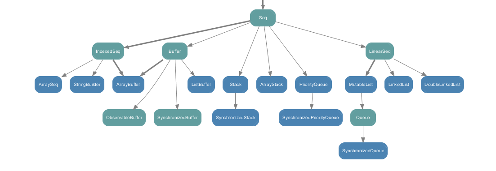

# Traverse FAQ
- [back to Index](index.md)

## Isn't Traverse parallel ? 

traverse itself is not spawning new threads, every value in `Traverse` is processed sequentially   

```scala
import cats.implicits._

import scala.concurrent.ExecutionContext.Implicits.global
import scala.concurrent.duration._
import scala.concurrent.{Await, Future}

def printInFuture(n: Int): Future[Unit] = {
  Thread.sleep(1000 / n) // bigger the number, shorter it takes
  Future(println(n))
}

def program = (1 to 10).toList.traverse(printInFuture)

Await.result(program, 1.minute)
// 1
// 2
// 3
// 4
// 5
// 6
// 7
// 8
// 9
// 10
```

*** Parallelism is up to implementation of `Applicative` e.g. 
 - scala.concurrent.Future is running each Future in parallel but
 - twitter.util.Future is running each Future one after the other (blocking)
 see [below](#how-is-traverse-related-to-futuretraverse-and-twitterutilfuturetraversesequentially)

## Why cats uses only List and Vector instead of Seq ?

A Seq is an Iterable that has a defined order of elements. Seq has many subclasses:


It would be too much to write and include a `Traverse` instance in cats library for every Seq's subclass

List will suffice for general purpose (I would say 99%)

there is also:
- `Vector` instance for Traverse if performance of indexed accessing is important, 
- [Chain](https://typelevel.org/cats/datatypes/chain.html) - cat's more performant "Seq like" implementation for Monoidal use and (constant time for prepending)
- [NonemptyList](https://typelevel.org/cats/datatypes/nel.html) - when empty List isn't allowed (is considered as a special case) *very useful data type


Looking at the cat's implementation of Traverse

- for List
```scala
def traverse[G[_], A, B](fa: List[A])(f: A => G[B])(implicit G: Applicative[G]): G[List[B]] =
  foldRight[A, G[List[B]]](fa, Always(G.pure(List.empty))) { (a, lglb) =>
    G.map2Eval(f(a), lglb)(_ :: _)
  }.value
```

- for Vector
```scala
override def traverse[G[_], A, B](fa: Vector[A])(f: A => G[B])(implicit G: Applicative[G]): G[Vector[B]] =
  foldRight[A, G[Vector[B]]](fa, Always(G.pure(Vector.empty))) { (a, lgvb) =>
    G.map2Eval(f(a), lgvb)(_ +: _)
  }.value
```

- for Chain 
- for NonEmptyList

it's obvious what would be type of empty sequence (List, Vector, Chain, NonEmptyList respectively)

but for Seq we don't know what will be the representation

trying to implement Traverse for Seq would end up with something like 

```scala
override def traverse[G[_], A, B](fa: Seq[A])(f: A => G[B])(implicit G: Applicative[G]): G[Seq[B]] =
  foldRight[A, G[Seq[B]]](fa, Always(G.pure(Seq.empty))) { (a, lgvb) =>
    G.map2Eval(f(a), lgvb)(_ +: _)
  }.value
```

where `Seq.empty` is always `List` (therefore List is most of the cases inferred type)

```scala mdoc
Seq.empty
```

## How is Traverse related to Future.traverse and twitter.util.Future.traverseSequentially

It's always up to implementation of traversed Applicative instance 

(the `F[_]` type in `def traverse[F[_]: Applicative, A, B](fa: List[A])(f: A => F[B]): F[List[B]]`)

in example, I used 10 elements traversed over some effect (take exactly 1 second to return the value) 

#### `Future.traverse`
```scala
import scala.concurrent.{Await, Future}
import scala.concurrent.duration.Duration
import scala.concurrent.ExecutionContext.Implicits.global

def effect[A](a: A): Future[A] = {
  Future {
    Thread.sleep(1000)
    a
  }
}
val start: Long = System.currentTimeMillis()
val result = Future.traverse((1 to 10).toList)(effect)
Await.result(result, Duration(1, TimeUnit.MINUTES))
val end: Long = System.currentTimeMillis()

println(s"${end - start} ms")
// 1136 ms
```
for scala Future 
- `Future.traverse` took ~ 1136 ms, which means as long as traverse get a Future instance it proceeds to the next value
- results are being evaluated in parallel

---
#### `twitter.util.Future.traverseSequentially`

```scala
import com.twitter

def effect[A](a: A): twitter.util.Future[A] = {
  twitter.util.Future {
    Thread.sleep(1000)
    a
  }
}

val start: Long = System.currentTimeMillis()
val result = twitter.util.Future.traverseSequentially((1 to 10).toList)(effect)
twitter.util.Await.result(result, twitter.util.Duration(1, TimeUnit.MINUTES))
val end: Long = System.currentTimeMillis()

println(s"${end - start} ms")
// 10091 ms

}
```

for twitter Future 
- `twitter.util.Future.traverseSequentially` took ~ 10091 ms, traverseSequentially is waiting for result to proceed to the next value 
- each evaluation is blocking

---

#### `Traverse.traverse` for `Future`

Using cats Applicative for scala Future

```scala
import cats.implicits._

def effect[A](a: A): Future[A] = {
  Future {
    Thread.sleep(1000)
    a
  }
}

val start: Long = System.currentTimeMillis()
val result = (1 to 10).toList.traverse(effect)
Await.result(result, Duration(1, TimeUnit.MINUTES))
val end: Long = System.currentTimeMillis()

println(s"${end - start} ms")
// 1376 ms
```

`Traverse.traverse` took 1376 ms - meaning cats traverse behave in same way as `Future.traverse` - in parallel

---

#### `Traverse.traverse` for `twitter.util.Future`
Using an implemented instance of Applicative for `twitter.util.Future`

```scala 
implicit val twitterFutureApplicative: Applicative[twitter.util.Future] = new Applicative[twitter.util.Future] {
  def pure[A](x: A): twitter.util.Future[A] = twitter.util.Future.value(x)
  def ap[A, B](ff: twitter.util.Future[A => B])(fa: twitter.util.Future[A]): twitter.util.Future[B] = ff.join(fa).map { case (ab, a) => ab(a) }
}
```

the

```scala
import cats.implicits._

def effect[A](a: A): twitter.util.Future[A] = {
  twitter.util.Future {
    Thread.sleep(1000)
    a
  }
}

val start: Long = System.currentTimeMillis()
val result = (1 to 10).toList.traverse(effect)
twitter.util.Await.result(result, twitter.util.Duration(1, TimeUnit.MINUTES))
val end: Long = System.currentTimeMillis()
println(s"${end - start} ms")
// 10437 ms
```
- meaning our Applicative implementation for twitter Future behaves same as twitter.util.Future.traverseSequentially (sequentially blocking)

